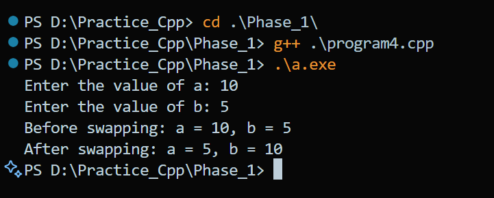
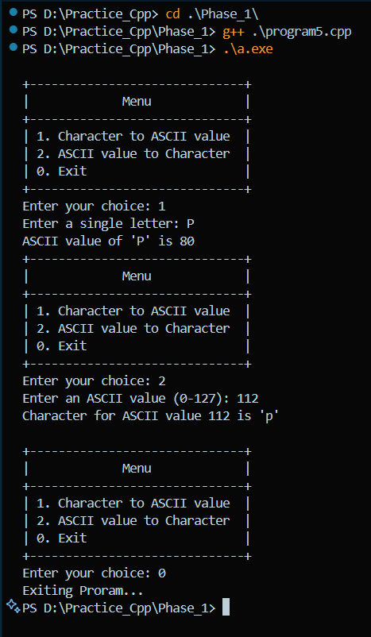

# Exam C++

## Phase 1 : Basic Program : 27 programs


1. Meena face an isuue to perform a mathematical operation to find a cube of any number. Write a C++ Program which helps Meena to solve her issue.

```cpp
#include <iostream>
using namespace std;

int cube(int num)
{
    return num * num * num;
}

int main() {
    int num;
    cout << "Enter a number: ";
    cin >> num;
    cout << "The cube of " << num << " is " << cube(num) << endl;
    return 0;
}

```

**Output:**


2. Sameer is too weak to find multiplication of any three numbers. Write a C++ Program which helps Sameer to solve his issue.

```cpp
#include <iostream>
using namespace std;


int multiply(int a, int b, int c);

int main()
{
    int num1, num2, num3;
    cout << "Enter value num1: ";
    cin >> num1;
    cout << "Enter value num2: ";
    cin >> num2;
    cout << "Enter value num3: ";
    cin >> num3;
    cout << "The multiplication of " << num1 << ", " << num2 << ", and " << num3 << " is " << multiply(num1, num2, num3) << endl;
    return 0;
}

int multiply(int a, int b, int c)
{
    return a * b * c;
}

```

**Output:**


3. A student in a fifth class encounters a very easy math problem to find quotient and remainder. Write a C++ Program which provides a solution for this particular problem.

```cpp
#include <iostream>
using namespace std;

/*
        3. A student in a fifth class encounters a very easy math problem to find quotient and remainder.
            Write a C++ Program which provides a solution for this particular problem.
*/

void quotient_remainder(int dividend, int divisor, int &quotient, int &remainder);

int main() {
    int dividend, divisor, quotient, remainder;
    cout << "Enter dividend: ";
    cin >> dividend;
    cout << "Enter divisor: ";
    cin >> divisor;

    quotient_remainder(dividend, divisor, quotient, remainder);

    cout << "Quotient: " << quotient << endl;
    cout << "Remainder: " << remainder << endl;

    return 0;
}

void quotient_remainder(int dividend, int divisor, int &quotient, int &remainder) {
    quotient = dividend / divisor;
    remainder = dividend % divisor;
}

```

**Output:**


4. Two classmates wants to exchange their seating with each other. But the problem is that there are only two chairs in the small classroom which already aquires by them. Write a C++ Program which provides a solution for this particular problem.

```cpp
#include <iostream>
using namespace std;

void swap(int &a, int &b);

int main()
{
    int a, b;
    cout << "Enter the value of a: ";
    cin >> a;
    cout << "Enter the value of b: ";
    cin >> b;
    cout << "Before swapping: a = " << a << ", b = " << b << endl;
    swap(a, b);
    cout << "After swapping: a = " << a << ", b = " << b << endl;
}
void swap(int &a, int &b)
{
    a = a + b;
    b = a - b;
    a = a - b;
}

```

**Output:**


5. Two college collegues had argue with a ASCII value conversion method. Write a C++ Program which provides a solution for their issue.

```cpp
#include <iostream>
#include <stdio.h>
#include <string.h>
#include <ctype.h>
using namespace std;

void displayMenu();

int main()
{
    int choice;
    do
    {
        displayMenu();

        cout << "Enter your choice: ";
        cin >> choice;
        cin.ignore();

        switch (choice)
        {
        case 1:
        {
            char input[10], letter;

            printf("Enter a single letter: ");
            fgets(input, sizeof(input), stdin);

            if (strlen(input) > 2 || !isalpha(input[0]) || input[1] != '\n')
            {
                cout << "Error: Input must be a single valid alphabet letter." << endl;
                return 1;
            }

            letter = input[0];
            int assci;
            assci = (int)letter;

            cout << "ASCII value of '" << letter << "' is " << assci;
        }
        break;

        case 2:
        {
            int ascii;
            cout << "Enter an ASCII value (0-127): ";
            cin >> ascii;
            cin.ignore();

            if (ascii < 0 || ascii > 127)
            {
                cout << "Error: Please enter a valid ASCII value between 0 and 127." << endl;
                break;
            }

            char letter = static_cast<char>(ascii);
            cout << "Character for ASCII value " << ascii << " is '" << letter << "'" << endl;
            break;
        }
        break;

        case 0:
            cout << "Exiting Proram...";
            break;

        default:
            cout << "Invalid choice...";
            break;
        }
    } while (choice != 0);
}

void displayMenu()
{
    cout << endl;
    cout << "+------------------------------+" << endl;
    cout << "|             Menu             |" << endl;
    cout << "+------------------------------+" << endl;
    cout << "| 1. Character to ASCII value  |" << endl;
    cout << "| 2. ASCII value to Character  |" << endl;
    cout << "| 0. Exit                      |" << endl;
    cout << "+------------------------------+" << endl;
}

```

**Output:**

