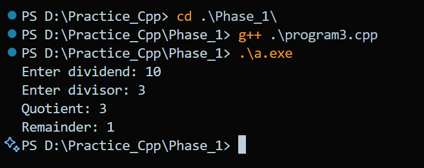

# Exam C++

## Phase 1 : Basic Program : 27 programs


1. Meena face an isuue to perform a mathematical operation to find a cube of any number. Write a C++ Program which helps Meena to solve her issue.

```cpp
#include <iostream>
using namespace std;

int cube(int num)
{
    return num * num * num;
}

int main() {
    int num;
    cout << "Enter a number: ";
    cin >> num;
    cout << "The cube of " << num << " is " << cube(num) << endl;
    return 0;
}

```

**Output:**


2. Sameer is too weak to find multiplication of any three numbers. Write a C++ Program which helps Sameer to solve his issue.

```cpp
#include <iostream>
using namespace std;


int multiply(int a, int b, int c);

int main()
{
    int num1, num2, num3;
    cout << "Enter value num1: ";
    cin >> num1;
    cout << "Enter value num2: ";
    cin >> num2;
    cout << "Enter value num3: ";
    cin >> num3;
    cout << "The multiplication of " << num1 << ", " << num2 << ", and " << num3 << " is " << multiply(num1, num2, num3) << endl;
    return 0;
}

int multiply(int a, int b, int c)
{
    return a * b * c;
}

```

**Output:**


3. A student in a fifth class encounters a very easy math problem to find quotient and remainder. Write a C++ Program which provides a solution for this particular problem.

```cpp
#include <iostream>
using namespace std;

void quotient_remainder(int dividend, int divisor, int &quotient, int &remainder) {
    quotient = dividend / divisor;
    remainder = dividend % divisor;
}

int main() {
    int dividend, divisor, quotient, remainder;
    cout << "Enter dividend: ";
    cin >> dividend;
    cout << "Enter divisor: ";
    cin >> divisor;

    quotient_remainder(dividend, divisor, quotient, remainder);

    cout << "Quotient: " << quotient << endl;
    cout << "Remainder: " << remainder << endl;

    return 0;
}

```
**Output:**

